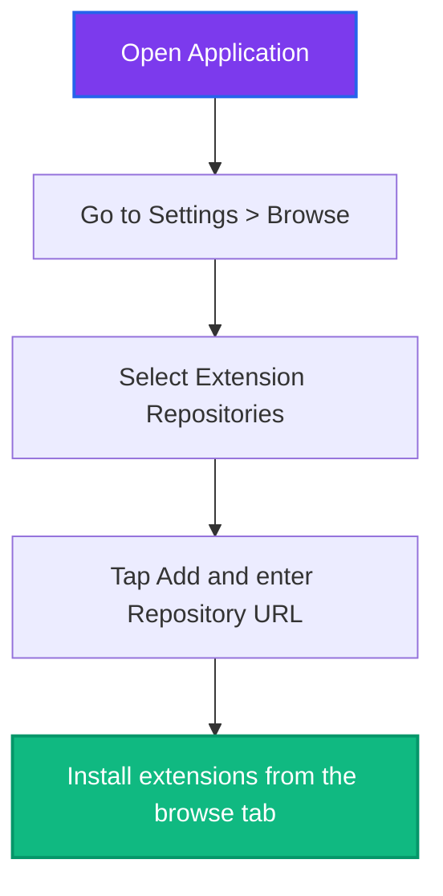

# <p align="center">Custom Extension Repository</p>

<p align="center">
  <a href="https://github.com/salmanbappi/sb-extensions-source">
    
  </a>
  <a href="https://github.com/salmanbappi/extensions-repo">
    
  </a>
  <a href="https://discord.gg/G6g4vBmcXp">
    
  </a>
  <a href="https://github.com/salmanbappi/extensions-repo/actions/workflows/update.yml">
    
  </a>
</p>

<p align="center">
  A premium, fully-automated repository for custom app extensions.<br>
  Providing secure and high-speed access to a collection of media extensions and content sources.
</p>

---

## 📲 Setup Guide

Adding this repository to your app is quick and easy:



1. Open the application on your device.
2. Go to **Settings** ➔ **Browse** ➔ **Extension repositories**.
3. Tap **Add** and paste the following repository index URL:
   ```text
   https://raw.githubusercontent.com/salmanbappi/extensions-repo/main/index.min.json
   ```
4. Navigate to the extensions section to view and install all available extensions.

---

## 💬 Community & Support

Have questions, suggestions, or need help setting up? Join our Discord server to connect with the community and get support:

<p align="center">
  <a href="https://discord.gg/G6g4vBmcXp">
    
  </a>
</p>

---

## 🛠️ Repository Specifications

| Specification | Value / Details |
| :--- | :--- |
| **Source Monorepo** | [salmanbappi/sb-extensions-source](https://github.com/salmanbappi/sb-extensions-source) |
| **Repository Index** | [salmanbappi/extensions-repo](https://github.com/salmanbappi/extensions-repo) |
| **Automation** | Rebuilt instantly via **GitHub Actions** workflows |

---

## ⚙️ Maintenance & Updates
This repository is automatically updated whenever new extension versions are compiled in the source monorepo. The CI/CD pipelines automate the extraction, index mapping, and repository metadata regeneration to ensure you always receive the latest releases.